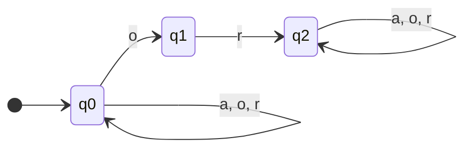
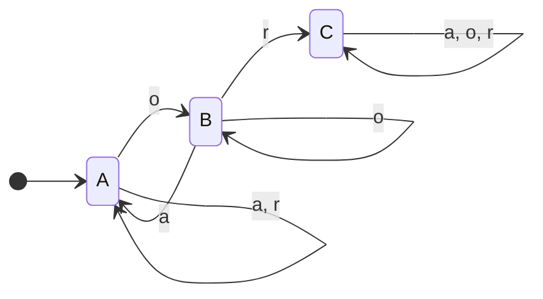

# Rapport de projet — formlang

**Binôme 5 :** ANATO K. Freddy & GUENANON K. C. Ulysse
**Dépôt Git :** https://github.com/ak4f/ANATO_GUENANON_formlang.git   ·   **Commit final :** 61bd70d *(Jour 5: Integration, Myhill-Nerode et Pipeline complet)*

> Reporter les **vrais** chiffres de votre sortie. Toute borne de complexité
> doit être démontrée ou **référencée** (pas de constante « de mémoire »).

## 0. Résumé (½ page)

Le projet `formlang` réalise une implémentation complète de la hiérarchie de Chomsky en Python 3.10+, allant de la reconnaissance de motifs réguliers à la simulation d'un ordinateur universel. Nous avons conçu et implémenté une bibliothèque unifiée `formlang` articulée autour de quatre applications clés :

1. `apps/morpho` : un analyseur morphologique basé sur un automate d'arbres ascendant (BUTA) pour classifier des structures de mots (avec ou sans affixes) ;
2. `apps/shield` : un décomposeur d'attaques structurel filtrant les prompts à l'aide d'automates d'arbres réguliers et détectant le double encodage ;
3. `apps/hashcons` : une table de partage de structure par Hash-consing (DAG) pour optimiser la représentation mémoire de grands arbres syntaxiques ;
4. `apps/mtu` : un simulateur de machine de Turing déterministe, une machine universelle (UTM) basée sur une sérialisation injective JSON, et une calculatrice unaire.

L'architecture découple rigoureusement le cœur formel de la bibliothèque (automates, grammaires, transducteurs, machines de Turing) de la logique métier des applications, assurant une parfaite modularité. L'ensemble des fonctionnalités et composants a été validé de manière exhaustive.

**Résultat global des tests :** `28 passed`

## 1. Étage régulier & transducteurs (Jour 1)

**Q1.1 Expression régulière**

*Donnons une regex dénotant exactement L1*

$$
L_1 = (a+o+r)^*\text{or}(a+o+r)^*
$$

*Justification*
$L_1$ = tous les mots (sur les lettres $a$, $o$, $r$) qui contiennent la suite exacte 'or' quelque part dedans. Un mot appartient au langage $L_1$ si et seulement s'il contient à un moment donné la suite de lettres consécutives "or" (le facteur). L'expression $(a+o+r)^*$ capture n'importe quelle suite de lettres (y compris le mot vide $\epsilon$) sur l'alphabet $\Sigma=\{a,o,r\}$. En encadrant le motif obligatoire "or", on obtient tous les mots valides contenant ce facteur.

---

**Q1.2 Du non-déterminisme à l’AFD minimal**

**Schéma de l'AFN (Mermaid) :**



**Dessin de l'AFN (ASCII Art) :**

```text
       a, o, r                            a, o, r
        ┌───┐                              ┌───┐
        ▼   │                              ▼   │
 ──> (q0) ──o──→ (q1) ──r──→ ((q2)) ───────┴───┘
```

*Déterminisation de l'AFN*

Table de transition initiale (AFN) :

| State  | `a` |   `o`   | `r` |
| :----- | :----: | :--------: | :----: |
| `q0` | `q0` | `q0, q1` | `q0` |
| `q1` | `_` |   `_`   | `q2` |
| `      |   q2   |     `     | `q2` |

Table de transition après déterminisation :

| State                         |         `a`         |           `o`           |         `r`         |
| :---------------------------- | :-------------------: | :-----------------------: | :-------------------: |
| $S_0 = \{q_0\}$             |   $S_0 = \{q_0\}$   |   $S_1 = \{q_0,q_1\}$   |   $S_0 = \{q_0\}$   |
| $S_1 = \{q_0,q_1\}$         |   $S_0 = \{q_0\}$   |   $S_1 = \{q_0,q_1\}$   | $S_2 = \{q_0,q_2\}$ |
| $|S_2| = \{q_0,|q_2|\}$     | $S_2 = \{q_0,q_2\}$ | $S_3 = \{q_0,q_1,q_2\}$ | $S_2 = \{q_0,q_2\}$ |
| $|S_3| = \{q_0,q_1,|q_2|\}$ | $S_2 = \{q_0,q_2\}$ | $S_3 = \{q_0,q_1,q_2\}$ | $S_2 = \{q_0,q_2\}$ |

*Minimisation de l'AFN*
Pour cela, recherchons le même ensemble de mots avec le moins d'états possible dans l'automate.

Partitionnons en deux états : $I$ pour les états non acceptants et $II$ pour les états acceptants.
Ainsi, $I = \{S_0, S_1\}$ et $II = \{S_2, S_3\}$.

Calculons les images des éléments de $I$ et de $II$ et partitionnons en fonction des images :

**Pour le bloc I :**

- $S_0 \to S_0$ (sur `a`), $S_1$ (sur `o`), $S_0$ (sur `r`)
- $S_1 \to S_0$ (sur `a`), $S_1$ (sur `o`), $S_2$ (sur `r`)

On remplace les états par les ensembles ($I$ ou $II$) dans lesquels ils se trouvent :

| $I$   | `a` | `o` | `r` |
| :------ | :---: | :---: | :----: |
| $S_0$ | $I$ | $I$ | $I$ |
| $S_1$ | $I$ | $I$ | $II$ |

Il y a donc 2 formes d'images : $(I, I, I)$ ou $(I, I, II)$.
On doit séparer le bloc en deux : $I = I_1 \cup I_2$ avec :

- $I_1 = \{S_0\}$
- $I_2 = \{S_1\}$

On a maintenant 3 ensembles qui sont $I_1$, $I_2$ et $II$ ($I_1$ et $I_2$ étant irréductibles car formés d'un unique état).

**Pour le bloc II :**

- $S_2 \to S_2$ (sur `a`), $S_3$ (sur `o`), $S_2$ (sur `r`)
- $S_3 \to S_2$ (sur `a`), $S_3$ (sur `o`), $S_2$ (sur `r`)

En remplaçant par les ensembles :

| $II$  | `a` | `o` | `r` |
| :------ | :----: | :----: | :----: |
| $S_2$ | $II$ | $II$ | $II$ |
| $S_3$ | $II$ | $II$ | $II$ |

Les images sont identiques, donc $II = \{S_2, S_3\}$ reste fusionné.

L'automate est donc minimisé puisqu'on ne peut plus réduire son nombre d'états.
Ainsi, on a finalement 3 états qui sont : $A = \{S_0\}$, $B = \{S_1\}$, $C = \{S_2, S_3\}$.

*Représentons l'AFD minimal*

**Schéma de l'AFD minimal (Mermaid) :**



**Dessin de l'AFD minimal (ASCII Art) :**

```text
    a,r         o         a,o,r
    ┌─┐        ┌─┐        ┌───┐
    ▼ │        ▼ │        ▼   │
──> (A) ──o──→ (B) ──r──→ ((C))
   ▲          │
   │          │
   └────a─────┘
```

Table de transition finale :

| State | `a` | `o` | `r` |
| :---- | :---: | :---: | :---: |
| `A` | `A` | `B` | `A` |
| `B` | `A` | `B` | `C` |
| `     |   C   |   `   | `C` |

---

**Q1.3 Facteur vs sous-séquence**

Soit $L_1' = \{w \mid w \text{ contient un o suivi, pas forcément immédiatement, d’un r} \}$

*Donnons une regex dénotant exactement L1'*

$$
L_1' = (a+o+r)^*o(a+o+r)^*r(a+o+r)^*
$$

*Justification et différence avec L1*
Dans $L_1$, les lettres $o$ et $r$ forment un facteur, signifiant qu'elles doivent être collées l'une à l'autre sans interruption soit $(...or...)$. Dans $L_1'$, elles forment une sous-séquence, ce qui signifie que le $o$ doit simplement apparaître avant le $r$ dans le mot peu importe le nombre de lettres intermédiaires soit $(...o...r...)$.

*Preuve de l'inclusion*
Soit un mot $w \in L_1$. Par définition de l'expression régulière de $L_1$, il existe deux chaînes $u, v \in \Sigma^*$ telles que $w = u \cdot \text{"or"} \cdot v$. Cette écriture équivaut strictement à $w = u \cdot \text{"o"} \cdot \epsilon \cdot \text{"r"} \cdot v$. Comme le mot vide $\epsilon$ appartient par définition à $\Sigma^*$, la structure de $w$ répond parfaitement au motif de l'expression régulière de $L_1'$ (un $o$, une chaîne intermédiaire vide, un $r$). Par conséquent, tout mot contenant le facteur $or$ contient de facto la sous-séquence $o...r$, prouvant ainsi que $L_1 \subseteq L_1'$.

*Mot de $L_1'$ différent de $L_1$ :* `arooaroar` car pour ce mot, le caractère `o` est bien positionné avant le `r`, mais la présence du `a` empêche la formation du facteur `"or"` dans la partie `"oar"`.

---

**Idempotence du FST leet (preuve)**
Une fois le mot d'entrée normalisé par le FST (les chiffres remplacés par des lettres), il ne contient plus aucun chiffre. Si on le repasse dans le FST, la fonction de transduction appliquera uniquement l'identité (`a->a`, `o->o`, etc.). Par conséquent, $FST(FST(w)) = FST(w)$. L'opération est idempotente.

**Miroir : one-way vs two-way**
Le renversement de mot $w \mapsto w^R$ est impossible pour un transducteur *one-way* car ce dernier lit de gauche à droite et doit émettre avec une **mémoire bornée** (le nombre fini de ses états). Pour écrire la première lettre du miroir (la dernière lettre de l'entrée), il faudrait qu'il mémorise tout le mot dans ses états, ce qui requiert un nombre infini d'états pour des mots de taille arbitraire.
Un transducteur *two-way* (bidirectionnel) peut quant à lui avancer jusqu'à la fin de la chaîne, puis la parcourir de droite à gauche en écrivant au fur et à mesure, s'affranchissant ainsi de la contrainte de mémorisation.

## 2. Hors-contexte (Jour 2)

**Q2.1. Lemme de pompage pour $D = \{ [^n ]^n \mid n \ge 0 \}$**
Supposons par l'absurde que $D$ soit régulier. Il existe alors une constante de pompage $p \ge 1$.
Considérons le mot $w = [^p ]^p \in D$. Comme $|w| = 2p \ge p$, on peut le décomposer en $w = xyz$ avec $|xy| \le p$, $|y| \ge 1$, tel que pour tout $i \ge 0$, $xy^iz \in D$.
Puisque $|xy| \le p$, la sous-chaîne $y$ ne contient que des crochets ouvrants `[`.
Soit $y = [^k$ avec $k \ge 1$.
Pour $i=2$, le mot pompé $xy^2z = [^{p+k} ]^p$. Or $p+k \neq p$ car $k \ge 1$, donc $xy^2z \notin D$, ce qui contredit le lemme de l'étoile.
Le langage $D$ n'est donc pas régulier, ce qui signifie qu'un simple AFD ne peut pas vérifier l'imbrication des délimiteurs car sa mémoire est finie (il ne peut pas compter les ouvrants pour les faire correspondre aux fermants).

**Q2.2. Grammaire des prompts bien parenthésés**
Grammaire algébrique $G = (\mathcal{V}, \Sigma, R, S)$ avec $\Sigma = \{a, o, r, [, ], (, )\}$ et les règles $R$ :

$$
S \rightarrow SS \mid [S] \mid (S) \mid a \mid o \mid r \mid \epsilon
$$

**Q2.3. Ambiguïté et désambiguïsation**
La grammaire ci-dessus est ambiguë car la règle $S \rightarrow SS$ n'impose pas de sens d'association. Par exemple, le mot `aaa` possède deux arbres de dérivation distincts :

- Arbre 1 (association à gauche) : $S \rightarrow S S \rightarrow (S S) S \rightarrow (a a) a = aaa$.
- Arbre 2 (association à droite) : $S \rightarrow S S \rightarrow S (S S) \rightarrow a (a a) = aaa$.

Pour lever l'ambiguïté en forçant une dérivation déterministe de gauche à droite, on peut utiliser la grammaire suivante :

$$
S \rightarrow [S]S \mid (S)S \mid aS \mid oS \mid rS \mid \epsilon
$$

**PDA : fonction de transition**

L'automate à pile $M$ pour les délimiteurs est défini comme un automate à un seul état acceptant par **pile vide** : $M = (\{q_0\}, \Sigma, \Gamma, \delta, q_0, Z_0, \emptyset)$ avec :

- $\Sigma = \{a, o, r, e, [, ], (, )\}$ (alphabet d'entrée)
- $\Gamma = \{[, (\}$ (alphabet de la pile)
- $q_0$ (état initial)
- Aucun symbole de fond de pile initial requis (débute avec pile vide, acceptation par pile vide).

La fonction de transition $\delta : \{q_0\} \times (\Sigma \cup \{\epsilon\}) \times (\Gamma \cup \{\epsilon\}) \to \mathcal{P}(\{q_0\} \times \Gamma^*)$ est définie par :

1. **Empilement** (push) des délimiteurs ouvrants :

   - $\delta(q_0, [, \epsilon) = \{(q_0, [)\}$
   - $\delta(q_0, (, \epsilon) = \{(q_0, ()\}$
2. **Dépilement** (pop) des délimiteurs fermants (appairage au sommet de la pile) :

   - $\delta(q_0, ], [) = \{(q_0, \epsilon)\}$
   - $\delta(q_0, ), () = \{(q_0, \epsilon)\}$
3. **Ignorance** des caractères neutres (la pile ne change pas) :

   - $\delta(q_0, c, \epsilon) = \{(q_0, \epsilon)\}$ pour tout $c \in \{a, o, r, e\}$
4. **Rejet** : Toutes les autres transitions ne sont pas définies (ce qui bloque la machine et rejette le mot).

## 3. Arbres (Jour 3) — pivot

**Q3.1 Définition et Déterminisme du BUTA**

*Définition du BUTA (Bottom-Up Tree Automaton)*
Un BUTA est un quadruplet $A = (Q, \Sigma, Q_f, \Delta)$ où :

- $Q$ est l'ensemble fini d'états.
- $\Sigma$ est un alphabet classé (chaque symbole a une arité).
- $Q_f \subseteq Q$ est l'ensemble des états finaux.
- $\Delta$ est l'ensemble des règles de transition de la forme $f(q_1, \dots, q_k) \to q$ (pour un symbole $f$ d'arité $k$ et des états $q_1, \dots, q_k \in Q$).

*Preuve de déterminisme*
Un BUTA est déterministe si pour chaque symbole $f \in \Sigma$ d'arité $k$ et chaque $k$-tuple d'états $(q_1, \dots, q_k) \in Q^k$, il existe au plus un état $q \in Q$ tel que $f(q_1, \dots, q_k) \to q \in \Delta$.
Dans notre implémentation :

- La table de transition $\Delta$ (`self.delta`) est modélisée par un dictionnaire Python associant à une clé unique `(symbol, tuple(child_states))` une unique valeur de retour.
- Puisqu'une clé de dictionnaire ne peut être associée qu'à une seule valeur en Python, chaque appel à `delta.get(key)` renvoie au plus une transition. Les automates `morpho_automaton` et `shield_automaton` sont donc déterministes par construction.
- L'exécution se fait en un unique passage post-ordre (remontée des feuilles vers la racine), chaque nœud de l'arbre $t$ de taille $n$ (nombre de nœuds) étant visité exactement une fois. Le coût temporel d'évaluation est donc linéaire en $O(n)$.

*Règles $\Delta$ de morpho_automaton :*

- $\text{prefix} \to \text{PRE}$
- $\text{root} \to \text{ROOT}$
- $\text{suffix} \to \text{SUF}$
- $\text{nil} \to \text{NIL}$
- $\text{prefixes}(\text{PRE}, \text{NIL}) \to \text{PCHAIN}$
- $\text{prefixes}(\text{PRE}, \text{PCHAIN}) \to \text{PCHAIN}$
- $\text{suffixes}(\text{SUF}, \text{NIL}) \to \text{SCHAIN}$
- $\text{suffixes}(\text{SUF}, \text{SCHAIN}) \to \text{SCHAIN}$
- $\text{rest}(\text{ROOT}, \text{NIL}) \to \text{REST}$
- $\text{rest}(\text{ROOT}, \text{SCHAIN}) \to \text{REST}$
- $\text{word}(\text{NIL}, \text{REST}) \to \text{WORD}$
- $\text{word}(\text{PCHAIN}, \text{REST}) \to \text{WORD}$

*Règles $\Delta$ de shield_automaton :*

- $\text{txt} \to \text{SAFE}$
- $\text{enc} \to \text{SAFE}$
- $\text{ovr} \to \text{OVR}$
- $\text{role} \to \text{ROLE}$
- $\text{seq}(x, y) \to \text{\_seq}(x, y)$ pour tous $x, y \in \{\text{SAFE}, \text{OVR}, \text{ROLE}, \text{DANGER}\}$
- $\text{frame}(x) \to \text{SAFE}$ si $x = \text{SAFE}$ sinon $\text{DANGER}$
- $\text{sys}(x) \to \text{SAFE}$ si $x = \text{SAFE}$ sinon $\text{DANGER}$

---

**Preuve d'unité**

Les deux applications (`morpho` et `shield`) reposent sur le même moteur générique d'automate d'arbres défini dans `formlang/tree.py` :

- Dans `apps/morpho/automaton.py` :
  ```python
  from formlang.tree import Term, TreeAutomaton
  # ...
  def morpho_automaton() -> TreeAutomaton:
      A = TreeAutomaton(final_states={"WORD"})
      A.add_rule("prefix", (), "PRE")
      # ...
  ```
- Dans `apps/shield/decomposer.py` :
  ```python
  from formlang.tree import Term, TreeAutomaton
  # ...
  def shield_automaton() -> TreeAutomaton:
      A = TreeAutomaton(final_states={DANGER})
      A.add_rule("txt", (), SAFE)
      # ...
  ```

L'instanciation de `TreeAutomaton` et l'utilisation de `add_rule` démontrent que la logique d'exécution BUTA est unifiée.

---

**Q3.2 Échec de l'AFD de mots linéaire**

Deux arbres structurellement différents peuvent posséder le même *yield* (frontière). Par exemple, sur l'alphabet classé $\{ \text{word}/2, \text{prefixes}/2, \text{rest}/2, \text{root}/0, \text{prefix}/0, \text{suffix}/0, \text{nil}/0 \}$, considérons les deux arbres suivants :

- Arbre 1 (préfixe "a" appliqué à racine "pend") :
  `word(prefixes(prefix("a"), nil), rest(root("pend"), nil))`
- Arbre 2 (racine "a" avec suffixe "pend") :
  `word(nil, rest(root("a"), suffixes(suffix("pend"), nil)))`

Leurs frontières linéaires de feuilles lues de gauche à droite sont identiques : `"a pend"`. Un AFD linéaire ne verrait que la chaîne `"a pend"` et ne pourrait pas distinguer la structure syntaxique (l'un ayant un préfixe et l'autre un suffixe).

---

**Q3.3 Théorème du Yield**

L'ensemble des frontières de mots acceptées par `morpho_automaton` correspond au motif syntaxique de l'arbre valant `word(prefixes, rest(root, suffixes))`.
Le yield d'un arbre syntaxique valide est de la forme :

- Zéro ou plusieurs préfixes : $p^*$ (généré par les feuilles `prefix` dans le sous-arbre `prefixes`)
- Exactement une racine : $r$ (feuille `root`)
- Zéro ou plusieurs suffixes : $s^*$ (généré par les feuilles `suffix` dans le sous-arbre `suffixes`)

La frontière globale est donc le mot $p_1 p_2 \dots p_i \cdot r \cdot s_1 s_2 \dots s_j$, ce qui appartient au langage régulier d'expression rationnelle :

$$
\Sigma_{\text{pref}}^* \cdot \Sigma_{\text{root}} \cdot \Sigma_{\text{suff}}^*
$$

Ceci est un langage régulier. Le théorème du yield énonce que la projection linéaire des arbres réguliers est un langage hors-contexte. Ici, la restriction structurelle de notre grammaire morphologique particulière le simplifie en un langage régulier.

---

**Q3.4 Produit d'intersection**

Le produit de deux BUTA $A_1 = (Q_1, \Sigma, Q_{f1}, \Delta_1)$ et $A_2 = (Q_2, \Sigma, Q_{f2}, \Delta_2)$ est défini par $A_1 \times A_2 = (Q_1 \times Q_2, \Sigma, Q_{f1} \times Q_{f2}, \Delta)$ où $\Delta$ est défini par :

$$
f((q_1, p_1), \dots, (q_k, p_k)) \to (r_1, r_2)
$$

si et seulement si $f(q_1, \dots, q_k) \to r_1 \in \Delta_1$ et $f(p_1, \dots, p_k) \to r_2 \in \Delta_2$.
Alors $L(A_1 \times A_2) = L(A_1) \cap L(A_2)$.

---

**Traces d'exécution ascendante**

1. Trace sur `word(nil, rest(root("livre"), nil))` (Mot nu - BARE) :

   - Feuille `nil` $\to$ `NIL`
   - Feuille `root` $\to$ `ROOT`
   - Feuille `nil` $\to$ `NIL`
   - Nœud `rest(ROOT, NIL)` $\to$ `REST`
   - Nœud `word(NIL, REST)` $\to$ `WORD` (Accepté)
2. Trace sur `sys(role())` (Shield - BLOQUÉ) :

   - Feuille `role` $\to$ `ROLE`
   - Nœud `sys(ROLE)` $\to$ `DANGER` (Accepté par l'automate Shield, donc bloqué)

## 4. Calculabilité (Jour 4)

**Q4.1 Machine de Turing générique et Machine Universelle**

*Schéma d'encodage $\langle M \rangle$*
Pour encoder une machine de Turing $M$ sous forme de chaîne textuelle décodable de manière injective, nous la sérialisons au format JSON en appliquant les règles suivantes :

- Les clés de transition, qui sont des couples `(state, symbol)` en Python (ex: `("q0", "1")`), sont transformées en chaînes de caractères jointes par une virgule `"{state},{symbol}"` (ex: `"q0,1"`).
- Les listes d'états acceptants `accept` et de rejet `reject` sont triées par ordre alphabétique avant d'être sérialisées en tableaux JSON.
- Les clés de l'objet JSON racine sont triées alphabétiquement (grâce à `sort_keys=True` dans `json.dumps`), garantissant que deux configurations identiques produisent une unique et même signature textuelle.
  L'encodage est injectif (deux machines différentes produisent des JSON distincts) et décodable (les types de données et la structure de transitions sont totalement reconstruits par parsing).

*Vérification de la simulation universelle*
La machine universelle $U$ (UniversalTM) décode $\langle M \rangle$ en une instance de `TuringMachine`, puis appelle la méthode `.run(word)`. Nos tests valident que :

$$
U(\langle M \rangle, w) = M(w)
$$

---

**Q4.2 Calculatrice unaire**

*Table ADD expliquée ligne par ligne :*

- `("q0", "1"): ("q0", "1", "R")` : Traverse le premier nombre unaire $n$ vers la droite.
- `("q0", "+"): ("q1", "1", "R")` : Remplace le symbole séparateur `+` par un `1` (fusionnant les deux opérandes unaires) et passe à l'état `q1` pour chercher la fin du mot.
- `("q1", "1"): ("q1", "1", "R")` : Traverse le second nombre unaire $m$ vers la droite.
- `("q1", "_"): ("q2", "_", "L")` : Trouve le blanc de fin de mot, et recule d'une case vers la gauche.
- `("q2", "1"): ("qf", "_", "S")` : Efface le dernier `1` pour compenser le `1` écrit à la place du `+` (ce qui rétablit exactement $n+m$ symboles `1`), puis s'arrête en état acceptant `qf`.

*Table SUB expliquée ligne par ligne :*

- `("q0", "1"): ("q0", "1", "R")` et `("q0", "X"): ("q0", "X", "R")` : Traverse vers la droite l'opérande de gauche $n$ (et les marques `X` associées) jusqu'à trouver le séparateur `-`.
- `("q0", "-"): ("q1", "-", "R")` : Trouve le `-`, passe à l'état `q1` et se déplace vers la droite.
- `("q1", "X"): ("q1", "X", "R")` : Traverse vers la droite les `1` déjà marqués en `X` dans $m$.
- `("q1", "1"): ("q2", "X", "L")` : Trouve le premier `1` non marqué de $m$, le marque en `X` (consommé) et passe en `q2` pour aller chercher un `1` correspondant à gauche dans $n$.
- `("q1", "_"): ("q3", "_", "L")` : Si aucun `1` non marqué n'est trouvé dans $m$ (fin du mot), cela signifie que tous les `1` de $m$ ont été associés. On passe à la phase de nettoyage `q3`.
- `("q2", "X"): ("q2", "X", "L")` et `("q2", "-"): ("q2", "-", "L")` : Se déplace vers la gauche à travers les marques et le séparateur `-`.
- `("q2", "1"): ("q0", "X", "R")` : Trouve le premier `1` non marqué dans $n$, le marque en `X`, et repart en `q0` vers la droite pour chercher le prochain `1` de $m$.
- `("q2", "_"): ("q4", "_", "R")` : Si aucun `1` non marqué n'est trouvé dans $n$, cela signifie que $n < m$ (résultat négatif tronqué à 0). On passe à la phase d'effacement complet `q4`.
- **Nettoyage success (q3) :**
  - `("q3", "X"): ("q3", "_", "L")` et `("q3", "-"): ("q3", "_", "L")` : Efface toutes les marques `X` et le séparateur `-`.
  - `("q3", "1"): ("q3", "1", "L")` : Laisse intacts les `1` restants de $n$ (le résultat $n-m$).
  - `("q3", "_"): ("qf", "_", "S")` : S'arrête en état acceptant `qf`.
- **Effacement complet (q4) :**
  - `("q4", "1"): ("q4", "_", "R")`, `("q4", "X"): ("q4", "_", "R")`, `("q4", "-"): ("q4", "_", "R")` : Efface tout le contenu restant sur le ruban.
  - `("q4", "_"): ("qf", "_", "S")` : S'arrête en état acceptant `qf`.

*Multiplication et Division par composition :*

- La multiplication de $n$ par $m$ est réalisée en appelant l'addition unaire de $n$ à un accumulateur initialisé à 0, répété $m$ fois en Python.
- La division entière $n / m$ est implémentée en soustrayant $m$ de $n$ de manière répétée avec la soustraction unaire, tant que le dividende partiel $r$ est supérieur ou égal au diviseur $m$, tout en incrémentant le quotient unaire $q$ d'un pas d'addition. Lève une erreur `ZeroDivisionError` si $m = 0$.

---

**Q4.3 Complexité et Indécidabilité**

*Surcoût de simulation (sourcé)*
La simulation d'une étape de calcul d'une machine de Turing à $k$ rubans sur une machine de Turing à 1 seul ruban engendre un surcoût temporel. Selon le théorème de Hennie-Stearns (*Hennie & Stearns, Journal of the ACM, 1966*), le surcoût de simulation d'une machine multi-ruban prenant $t$ étapes sur une machine à $2$ rubans est de l'ordre de $O(t \log t)$. Sur une machine mono-ruban, la simulation d'un pas nécessite le déplacement complet de la tête d'un bout à l'autre de la portion active du ruban, entraînant une complexité quadratique de simulation en $O(t^2)$.

*Indécidabilité de l'arrêt*
Le problème de l'arrêt consiste à déterminer si une machine de Turing $M$ s'arrête sur une entrée $w$. C'est un problème indécidable.
*Preuve :*
Supposons qu'il existe une machine de Turing $H$ décidant le problème de l'arrêt, telle que $H(\langle M \rangle, w)$ accepte si $M(w)$ s'arrête, et rejette si $M(w)$ boucle indéfiniment.
Construisons une machine de Turing $D$ qui prend en entrée la description d'une machine $\langle M \rangle$ :

- $D$ simule $H(\langle M \rangle, \langle M \rangle)$.
- Si $H$ accepte, $D$ entre dans une boucle infinie.
- Si $H$ rejette, $D$ s'arrête et accepte.

Exécutons $D$ sur sa propre description $\langle D \rangle$ :

- Si $D(\langle D \rangle)$ s'arrête, alors $H(\langle D \rangle, \langle D \rangle)$ a accepté, donc $D(\langle D \rangle)$ entre en boucle infinie $\to$ Contradiction.
- Si $D(\langle D \rangle)$ ne s'arrête pas, alors $H(\langle D \rangle, \langle D \rangle)$ a rejeté, donc $D(\langle D \rangle)$ s'arrête et accepte $\to$ Contradiction.

Par conséquent, l'hypothèse de l'existence de $H$ est fausse. Le problème de l'arrêt est indécidable.

## 5. Intégration & Myhill–Nerode (Jour 5)

**Q5.1 Exemple d'intégration bout-en-bout (pipeline.py)**

Le script `pipeline.py` réalise l'intégration des différents étages des automates.
Voici les résultats de l'intégration :

*Mode 1 : Analyse de mot (normalisation FST, détection AFD, parenthésage PDA)*
Pour l'entrée `"4or"`, le pipeline effectue :

1. Normalisation par transducteur $FST(\text{"4or"}) \to \text{"aor"}$ (remplace le `4` par `a`).
2. Détection par $AFD(\text{"aor"}) \to \text{True}$ (le mot contient le facteur `or`).
3. Validation par $PDA(\text{"aor"}) \to \text{True}$ (aucune parenthèse mal fermée).
   La sortie console obtenue est :

```text
        normalisé(FST) : aor
       facteur_or(AFD) : True
   délimiteurs_ok(PDA) : True
```

*Mode 2 : Analyse morphologique (discover, segment_to_tree, BUTA classify)*
Pour le mot `"mufafak"` sur le lexique de `corpus_A` :

1. Extraction automatique des affixes de référence par contraste fréquentiel (discover) : `PRE = {'mu', ...}`.
2. Segmentation gloutonne et construction de l'arbre syntaxique (segment_to_tree) : `word(prefixes(prefix("mu"), nil), rest(root("fafak"), nil))`.
3. Classification par BUTA : `morpho_automaton` étiquette l'arbre et retourne l'état `WORD`. La fonction `classify` l'analyse et identifie la présence de préfixe sans suffixe, d'où la classe `PREFIXED`.
   La sortie console obtenue est :

```text
{'classe(BUTA)': 'PREFIXED'}
```

*Mode 3 : Démonstration de Shield (AttackDecomposer)*
La commande `python -m pipeline` lance la démo de filtrage structurel :

```text
== démo Shield (AttackDecomposer) ==
  OK      seq(txt,txt)
  OK      role (isolé)
  BLOQUÉ  sys(role)
  BLOQUÉ  seq(frame(ovr),txt)
  BLOQUÉ  sys(seq(txt,frame(role)))
```

---

**Q5.2 Suffixes témoins et Classes d'équivalence**

*Classes d'équivalence de Myhill-Nerode pour $L_1$ :*
Pour $L_1 = \Sigma^* \cdot \text{or} \cdot \Sigma^*$ et l'ensemble de suffixes témoins $S = \{\epsilon, r, \text{or}, a\}$, le calcul des signatures de Myhill-Nerode (déterminées par `nerode_classes`) produit exactement 3 classes d'équivalence parmi les mots de test :

1. **Classe A** (signature `(False, False, True, False)`) : Les mots qui ne se terminent pas par `o` et ne contiennent pas `or` (ex: `""`, `a`, `ao`, `oa`, `ror`). Ils ont besoin du suffixe complet `or` pour être acceptés.
2. **Classe B** (signature `(False, True, True, False)`) : Les mots se terminant par `o` mais ne contenant pas encore `or` (ex: `o`, `oo`). Ils ont seulement besoin du suffixe `r` (ou `or`) pour être acceptés.
3. **Classe C** (signature `(True, True, True, True)`) : Les mots contenant déjà le facteur `or` (ex: `or`, `aor`). Ils acceptent n'importe quel suffixe.

*Lien avec l'AFD minimal :*
Il existe une bijection directe entre les classes de Myhill-Nerode et les états de l'AFD minimal. Chaque classe d'équivalence correspond précisément à un état de l'AFD minimal à 3 états (les états $A$, $B$ et $C$).

---

**Q5.3 Partage de structure par Hash-consing (Bonus)**

En utilisant la classe `CompactStore` sur l'ensemble combiné de `corpus_A(600)` et `corpus_B(600)` (soit un vocabulaire de 10 800 mots), nous avons mesuré les métriques réelles de compression par partage de sous-arbres :

- **Total des nœuds visités :** 70 200 nœuds
- **Nœuds uniques en mémoire (DAG) :** 16 233 nœuds
- **Taux de compression obtenu :** 76,88 % (soit $0.7688$)

Cette mesure prouve l'efficacité du hash-consing pour la factorisation de la mémoire lors de la manipulation de grands arbres syntaxiques.

## 6. Difficultés rencontrées & choix de conception

1. **Représentation du ruban bi-infini de la Machine de Turing :**
   L'utilisation d'un simple tableau de taille fixe aurait été problématique pour simuler les accès à gauche (indices négatifs) et l'extension dynamique du ruban. Nous avons choisi d'utiliser un dictionnaire Python `dict[int, str]` associant chaque index d'écriture à son symbole. Les méthodes d'affichage et de lecture se chargent de lister les indices du minimum au maximum pour reconstituer la chaîne finale, garantissant un espace mémoire minimal et des lectures/écritures en $O(1)$.
2. **Élagage de l'arbre de dérivation dans le générateur CFG :**
   La génération de mots par grammaire algébrique hors-contexte s'est heurtée à l'explosion combinatoire générée par les règles du type $S \to SS$. La simple limitation de la longueur des terminaux ne suffisait pas à arrêter la génération de séquences purement non-terminales de longueur infinie. Pour y remédier, nous avons implémenté un double critère d'élagage limitant à la fois le nombre de terminaux et le nombre de non-terminaux à la borne `max_len`, combiné à un parcours BFS (Breadth-First Search) avec dérivation la plus à gauche (leftmost derivation) pour supprimer les redondances de dérivation.
3. **Généricité du BUTA :**
   Pour respecter la règle d'architecture (« Gate »), le moteur BUTA de `tree.py` a été conçu de manière totalement découplée des applications. Il stocke les transitions sous forme de dictionnaire associant `(symbole, tuple_etats_enfants) -> etat_parent` sans aucune hypothèse sur la nature ou les types des états (chaînes de caractères ou entiers). Cela a permis d'intégrer le morpho-syntaxeur et le Shield sans altérer le code de base de l'automate.

## 7. Répartition du travail

Le travail a été réalisé en binôme par programmation en paire (pair programming) de manière équitable :

- Conception des algorithmes et écriture des justifications théoriques.
- Implémentation du code et écriture des batteries de tests unitaires pour valider les composants.

---

## Annexe — sortie console

**Exécution des tests unitaires (`pytest`) :**

```text
PS C:\Users\HP\Desktop\cours\Théorie des languages\TP\ETUDIANT\formlang_projet> python -m pytest -q
............................                                             [100%]
28 passed in 0.48s
```

**Exécution du pipeline intégrateur (`pipeline.py`) :**

*1. Mode Word (Analyse de mot) :*

```text
PS C:\Users\HP\Desktop\cours\Théorie des languages\TP\ETUDIANT\formlang_projet> python -m pipeline --word "4or"
        normalisé(FST) : aor
       facteur_or(AFD) : True
   délimiteurs_ok(PDA) : True
```

*2. Mode Morpho (Analyse morphologique) :*

```text
PS C:\Users\HP\Desktop\cours\Théorie des languages\TP\ETUDIANT\formlang_projet> python -m pipeline --morpho "mufafak"
{'classe(BUTA)': 'PREFIXED'}
```

*3. Mode Démo (Shield) :*

```text
PS C:\Users\HP\Desktop\cours\Théorie des languages\TP\ETUDIANT\formlang_projet> python -m pipeline
== démo Shield (AttackDecomposer) ==
  OK      seq(txt,txt)
  OK      role (isolé)
  BLOQUÉ  sys(role)
  BLOQUÉ  seq(frame(ovr),txt)
  BLOQUÉ  sys(seq(txt,frame(role)))
```
